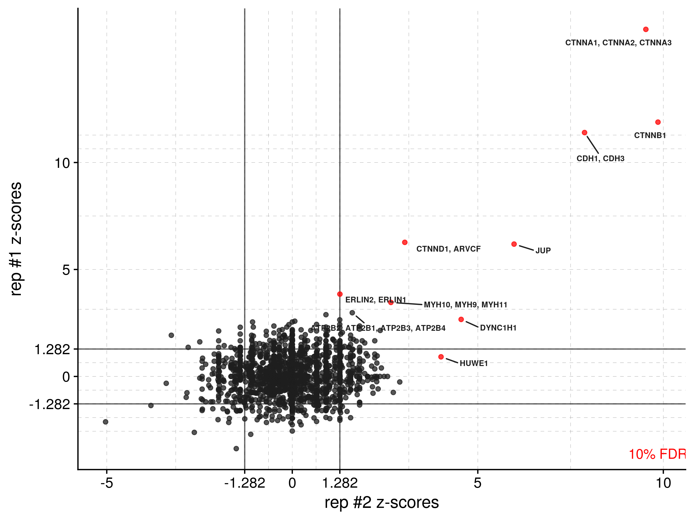

# diffprot
Annotate, compute, and visualize fold-changes and Z-scores for differential mass spectrometry proteomics results.

## Functions
More detailed descriptions of each function and their parameters can be accessed in R by using `?enrich`, `?psmplot`, `?combine_reps`, `?combine_exps`, or `?zplot`. Briefly, features of this package are provided below:

- **`enrich()`**: Compute AUC XICs fold-changes (optional) and PSMs fold-changes/Z-scores for `_Proteins.txt` and `_PSMs.txt` assignment files output by Proteome Discoverer 2.3. Annotates results given an annotation table (optional). Annotation table must contain column named `gene_names_primary`. Outputs a .csv file with results.
- **`psmplot()`**: Visualize control PSMs versus test PSMs on a log-log plot. Uses dataframe output by `enrich()` as input. Requires annotation column with name ending in `gene_names_primary`. Outputs .png and .pdf files.
- **`combine_reps()`**: Combine biological replicates, i.e., combines dataframes output by `enrich()`. Outputs a .csv file with results.
- **`combine_exps()`**: Combines experiments, i.e., combines dataframes output by `combine_reps()`.
- **`zplot()`**: Visualize PSM-based Z-scores for proteins biological replicates. Uses dataframe output by `combine_reps()` or `combine_exps()` as input. Requires annotation column with name ending in `gene_names_primary`. Outputs .png and .pdf files.

## Data preparation

The `enrich()` function requires a minimum of 3 files to work:

1. A tab-delimited `_Protein.txt` file from Proteome Discoverer.
2. A tab-delimited `_PSMs.txt` file from Proteome Discoverer.
3. A manually generated, tab-delimited `_meta.txt` file that describes the relationship between control/test samples and their file IDs assigned by Proteome Discoverer.
4. (Optional) A tab-delimited annotation file with columns `accession` and `gene_names_primary`.

#### **Preparing Proteome Discoverer files**

The first two files must be output from Proteome Discoverer in a specific way. **The control and test samples must be processed under a consensus workflow, such that each replicate experiment has its own .pdResult file.** In the following example, an APMS experiment with two biological replicates are processed. The first biological replicate has 4 technical replicates for each control and test sample (8 mass spectrometry injections total). The second biological replicate has 2 technical replicates for each control and test sample (4 mass spectrometry injections total). The test sample contains a GFP-Cadherin fusion and the control sample contains a GFP-only vector.


In the above screenshots, there are 4 technical replicates for both the test (GFPc-Cdh_1a-d) and control (GFP_1a-d) samples for biological replicate #1. All technical replicates, for both the control and test sample, are processed together into a single results file, `cadherin_b1_052920.pdResult`. Biological replicate #2 has 2 technical replicates for the test (GFP-c-Cdh_repeat_1a/b) and control (GFP_1a/b), which are processed together into another result file `cadherin_b1_052920.pdResult`.

Open each .pdResult file and export tab-delimited `_Proteins.txt` and `_PSMs.txt` files as shown in the screenshot below (remember to check "Generate R-Friendly Headers"):


Finally, move these files to your project directory for subsequent analysis in R. For two biological replicates, you should have 4 total files (for 3 biological replicates, you would have 6 total files, etc):


#### Preparing the meta file

Proteome Discoverer will assign a unique file ID for each injection of each sample in your experiments, as shown in the second column of the screenshot below (F19-F30):


The `enrich()` function needs to know which file IDs correspond to test and control samples, and which of those correspond to which biological replicate. This is achieved with a **tab-delimited** `meta.txt` file with three columns, `exp_name`, `type`, and `id`. For this example APMS experiment, the information above is converted to the meta file below:


I usually make the meta files in Vim, though any text editor will do. You can also make the file in Excel and export as tab-delimited. Whatever you do, it's a good idea to run `cat -T <filename>` to show tabs and make sure Excel hasn't added anything strange.

## Installation
Run the following code:
```r
install.packages("devtools")  # if devtools not installed
devtools::install_github("rachaelcox/diffprot")
library(diffprot)
```
## Example workflow
Compute fold-changes and Z-scores for test versus control samples for each biological replicate using **`enrich()`**. This function outputs a .csv (openable in Excel) with statistics computed for each protein detected in either the test or control cases. In this APMS example, we are only interested in proteins positively enriched in our test case, so we need to set `one_sided = TRUE` to specify we want one-sided probability statistics.
```r
# compute differential protein abundance for 1 biological replicate
cadherin_b1 <- enrich(exp_id = "cadherin_b1",
                      meta_file = "cadherin_meta.txt",
                      psm_file = "cadherin_b1_052920_Proteins.txt",
                      pd_file = "cadherin_b1_052920_PSMs.txt",
                      one_sided = TRUE)
```
We often use abstract accessions or grouped identifiers in search databases for assigning peptide mass spectrometry data. Sometimes these accessions are not useful, so this package will also annotate your data given a properly formatted annotation file (UniProt is a great source for this). The annotation file **must** be tab-delimited and **must** contain columns called `accession` and `gene_names_primary`.
```r
# optionally annotate your data
cadherin_b1 <- enrich(exp_id = "cadherin_b1",
                      meta_file = "cadherin_meta.txt",
                      psm_file = "cadherin_b1_052920_Proteins.txt",
                      pd_file = "cadherin_b1_052920_PSMs.txt",
                      one_sided = TRUE,
                      annot_file = "xenla_annots.tab",
                      outfile_name = "inst/extdata/cadherin_b1")
```
The enrichment of protein PSMs over the control can be visualized on a log-log plot using **`psm_plot()`**. If you previously annotated your data with a table downloaded from UniProt, the function will detect the column `gene_names_primary` and use it to label data points (default = 10; set `num_labs` to customize). Points are colored by statistical significance, depending on what threshold you set (one of 90%, 95%, or 99%). Significance is based on 


, and multiple hypothesis corrected by the Benjamini-Hochberg procedure (see [this paper](https://elifesciences.org/articles/58662) for additional details).
```r
psmplot(data = cadherin_b1, 
        xlab = "control PSMs", 
        ylab = "test PSMs", 
        threshold = 90, 
        outfile_prefix = "inst/extdata/figures/cad_b1")
```
Which saves .pdf and .png files that look like this:


Ideally you have more than one biological replicate to power your results; if so, you can use **`combine_reps()`** to combine them, calculate a `joint_zscore` and resulting probability statistics. This function outputs another .csv file containing PSM calculations for both biological replicates, sorted automatically by `joint_zscore`.
```r
# compute differential protein abundance for biological replicate #2
cadherin_b2 <- enrich(exp_id = "cadherin_b2",
                      meta_file = "cadherin_meta.txt",
                      psm_file = "cadherin_b2_052920_Proteins.txt",
                      pd_file = "cadherin_b2_052920_PSMs.txt",
                      one_sided = TRUE,
                      annot_file = "xenla_annots.tab",
                      outfile_name = "inst/extdata/cadherin_b2")

# combine bio reps
cadherin_all <- combine_reps(rep1 = cadherin_b1,
                             rep2 = cadherin_b2,
                             one_sided = TRUE,
                             outfile_prefix = "inst/extdata/cadherin_all")
```
With two or more biological replicates combined into one dataframe (in this example, `cadherin_all`), you can visualize the consistency between replicates by using **`zplot()`**. Again, points are colored by a set confidence threshold (one of 90, 95, or 99) that's multiple hypothesis corrected, and solid lines are drawn on the plot to show Z-score cutoffs for that threshold. [This paper](https://elifesciences.org/articles/58662) contains equations for the Z-score calculation and additional analysis details.
```r
zplot(data = cadherin_all, xlab = "rep #2 z-scores", xcol = "PSM_zscore_b2",
      ylab = "rep #1 z-scores", ycol = "PSM_zscore_b1", threshold = 90,
      outfile_prefix = "inst/extdata/figures/cadherin")
```



